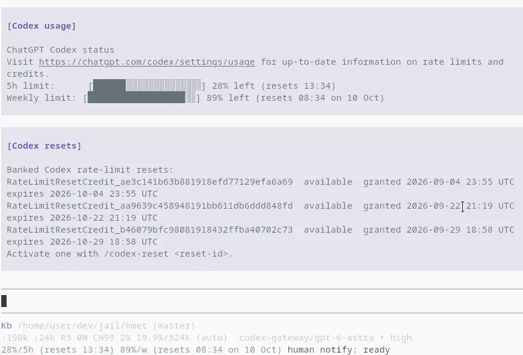

# Codex usage for kmet

A standalone port of the [pinned Pi Codex usage extension](https://github.com/jasalt/chatgpt-openai-api-adapter/blob/94f45568b4bd7842b1aef362cc3ba883b1312951/contrib/pi-codex-usage.ts).



## Install

Link the **src directory** (the artifact root) into kmet's extensions directory:

```sh
mkdir -p ~/.kmet/agent/extensions
ln -s "$PWD/src" ~/.kmet/agent/extensions/codex-usage
```

Run those commands from this directory, then start kmet or use `/reload`.
`KMET_CODING_AGENT_DIR` overrides `~/.kmet/agent`. Alternatively, add the
absolute path to this project's `src` to `:extensions` in your settings.

## Use

The existing footer receives a dim, keyed status such as:

```text
76.5%/5h (resets 18:20)  42%/w (resets 09:10 on 8 Oct)
```

Percentages show **remaining**, not consumed, quota. Reset times use your
local time zone; windows of at least a day include the date. The primary
window is shown, along with a weekly window within 5% of seven days.

- `/codex-usage`: refresh and show the account, plan, and twenty-cell bars.
- `/codex-reset`: list banked resets, earliest expiry first.
- `/codex-reset <reset-id>`: redeem that exact ID, then refresh usage.
  This is a real account mutation; there is no extra confirmation, matching Pi.

Explicit command output (usage cards, reset lists, activation results, and
errors) is appended to the conversation area as labeled info messages, not
brief flashes. It stays in the live transcript, is never sent to the model,
and is not saved across restarts or session resume. Errors are labeled
`Codex usage error` or `Codex resets error`.

Refresh runs at session start, model selection, agent settlement, and every
five minutes. Automatic refreshes remain footer-only; background failures
silently clear only this meter. Model switches and unload invalidate older
responses; unload wakes the polling worker immediately. Other status keys,
the builtin footer, editor, and widgets are untouched. Headless commands
fall back to notifications; headless UI calls are inert.

For `openai-codex`, kmet's resolved OAuth access token supplies the ChatGPT
account ID and account details. Requests use ChatGPT's WHAM usage and
reset-credit endpoints. For other selected providers, the extension uses
kmet's resolved API key and configured headers and requests the selected
model's base URL plus `/codex/usage`, `/codex/resets`, or `/codex/reset`.
The provider must implement the adapter endpoints; an ordinary OpenAI API
endpoint will not work. No credentials are read directly from disk.

All requests use `kmet.libs.http` (proxy settings honored), with a 15-second
timeout. The original `originator: pi` header is retained for native requests.

## Development

This project expects a sibling `../../kmet` checkout for host libraries:

```sh
bb test
cd ../../kmet
bb ../kmet-extensions/codex-usage/scripts/smoke.bb
bb lint ../kmet-extensions/codex-usage/src ../kmet-extensions/codex-usage/test ../kmet-extensions/codex-usage/scripts
bb format-check ../kmet-extensions/codex-usage/src ../kmet-extensions/codex-usage/test ../kmet-extensions/codex-usage/scripts ../kmet-extensions/codex-usage/bb.edn
bb pack-extension ../kmet-extensions/codex-usage/src target/codex-usage.jar
```

Tests are offline: usage validation, presentation, native/adapter auth and
requests, commands, reset credits, stale responses, and unload behavior.
The smoke script exercises the actual isolated SCI loader and live interactive
model context (resolved model records, not bare IDs), request-auth resolution,
commands, and unload with offline credential/HTTP seams. The manifest allows both native Jolt and SCI loaders. Jolt execution and live
account/terminal behavior require those environments and are not covered by
the offline suite. Local date rendering follows the host's locale/date library
rather than JavaScript's Intl implementation.
