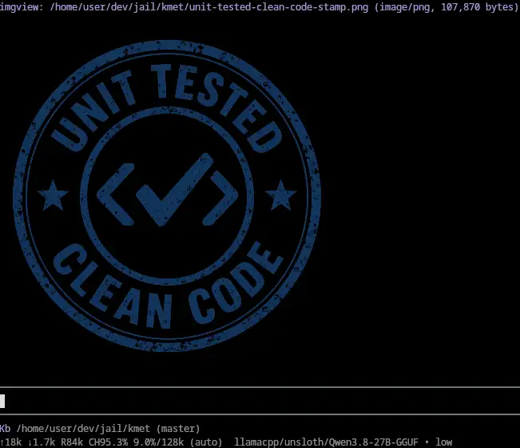

# imgview for kmet

Port of [gregjohnso/pi-imgview](https://github.com/gregjohnso/pi-imgview),
referenced at `17b568e8e3b70d009adb8ac090d2b3280f065f11`. Displays existing
images; it does not generate them. No external runtime dependencies or settings.
Upstream's MIT license and attribution are retained in `LICENSE`.




## Install

From the sibling **kmet checkout** (no `kmet` executable required):

```sh
bb start install ../kmet-extensions/imgview/src
```

With an installed executable, the equivalent is `kmet install /absolute/path/to/imgview/src`.
Add `--local` for project scope. `src/` is the extension artifact root, not the
project directory. Restart kmet or run `/reload`.

For live development, symlink `src/` into `~/.kmet/agent/extensions/imgview`
or the project's `.kmet/extensions/imgview`. The global directory honors
`KMET_CODING_AGENT_DIR`. The manifest declares native Jolt and SCI loaders.

## Commands

| Command | Effect |
| --- | --- |
| `/imgcat <source>` | Inline terminal image |
| `/imgshow <source>` | System default browser |
| `/imgboth <source>` | Both |

```text
/imgcat screenshots/result.png
/imgcat ~/Pictures/photo.jpg
/imgcat /absolute/path/image.png
/imgcat https://example.com/image.png
/imgshow diagrams/large diagram.svg
/imgboth data:image/png;base64,...
```

The whole trimmed argument is the source; spaces in paths need no shell quotes.
Local paths resolve against the **current command/tool cwd** and expand a
leading `~/`. HTTP(S) URLs follow redirects through `kmet.libs.http`, honoring
kmet's proxy settings. Data URIs may contain base64 or percent-encoded payloads
(`+` is literal). Unknown/non-image types and missing/non-regular files fail
clearly; declared MIME or a filename extension is only a fallback to magic bytes.

## Agent tool: `show_image`

| Parameter | Meaning |
| --- | --- |
| `source` (required) | Local image path, HTTP(S) URL, or data URI |
| `mode` | `terminal` (default), `browser`, or `both` |
| `caption` | Optional note, up to 200 characters |

Terminal/both results use kmet's native `{:content "summary", :images [{:data
"base64", :mime-type "image/png"}], :details {...}}` shape, so both the normal
TUI and provider adapters receive the image. Browser-only results contain text,
not image base64.
The tool reports a loading update and checks the run's abort atom before and
after loading and before launching a browser. The signal also goes to HTTP;
mid-request cancellation follows the host HTTP transport (curl actively cancels,
platform transport checks again when it returns).

Browser mode is **opt-in**: tool guidance prohibits choosing `browser`/`both`
unless the user explicitly asks for a browser or zoomable high-resolution view.
Terminal fallback does not automatically open a browser.

Files above **8 MiB** add a warning, not a rejection or resize. This is only a
soft cap: local and downloaded images are loaded fully into memory.

## Rendering and persistence

Accepted MIME types match upstream: PNG, JPEG, GIF, WebP, BMP, AVIF, and SVG.
Inline display uses kmet's shared terminal image implementation. Currently that
implementation renders PNG/JPEG/GIF using its Kitty-protocol path and falls back
to a text attachment placeholder otherwise; actual support depends on the host
terminal. Unlike Pi, kmet does **not** automatically convert other formats to
PNG, provide an iTerm2-specific encoder, or enable images through tmux. Use an
explicit browser command for formats/terminals that show only a placeholder.

The tool path inherits kmet's normal tool-result rendering, including image and
tool-display settings. `/imgcat` and `/imgboth` send an `imgview-image` custom
message with image bytes stored in `:details`, rendered by a shared TUI Image
component at a maximum width of 60 cells (as upstream). That custom renderer
uses terminal capabilities directly rather than the tool-result display setting.

These slash-command messages are persisted in the session and inject a **text
summary** into agent context, without requesting another model turn
(`:trigger-turn false`, `:deliver-as :follow-up`). Their image data lives in
metadata, not an image block sent to the model. Browser-only commands do not
add a transcript message.

## Browser viewer

An image is embedded in a self-contained UTF-8 HTML viewer, opened with:

- macOS: `open <viewer.html>`
- Linux/WSL/Termux: `xdg-open <viewer.html>`
- Windows: `cmd /c start "" <viewer.html>`

The opener must be installed and accessible. Linux needs a working desktop
browser association; WSL/Termux depend on their configured `xdg-open` bridge.
Unix launches pass argv directly without shell interpolation. Launching is
asynchronous: missing executables are errors, but the extension cannot confirm
that a started opener actually created a visible browser window.

Viewers are private, uniquely named `imgview-*.html` files under
`$TMPDIR/kmet-imgview`, `$PREFIX/tmp/kmet-imgview` on Termux when TMPDIR is
unset, or the host's temporary directory otherwise. They remain on disk across
reload/unload so the browser can keep reading them; remove old viewers manually
when no longer needed. Downloads use temporary binary files in the same root,
closed and deleted on success, error, or cancellation.

Browser launch errors do not claim an opened path. Browser-only tool failures
are error results; `both` retains the useful inline image with a browser-error
note. Browser-only command failures emit only an error, not a misleading success
notification. These are deliberate error-reporting improvements over upstream.

## Development

From this extension directory, using the sibling `../../kmet/src` checkout:

```sh
bb test-changed
bb test imgview.utils-test imgview.core-test
```

Tests are offline: no real browser launches, network calls, or sleeps. Disposable
fixtures live under `target/`; new test namespaces belong in this project's
`bb.edn`, not kmet's test runner.

From the sibling kmet checkout:

```sh
bb ../kmet-extensions/imgview/scripts/smoke.bb
bb lint ../kmet-extensions/imgview/src ../kmet-extensions/imgview/test ../kmet-extensions/imgview/scripts ../kmet-extensions/imgview/bb.edn
bb format-check ../kmet-extensions/imgview/src ../kmet-extensions/imgview/test ../kmet-extensions/imgview/scripts ../kmet-extensions/imgview/bb.edn
bb pack-extension ../kmet-extensions/imgview/src target/imgview.jar
bb ../kmet-extensions/imgview/scripts/smoke.bb target/imgview.jar
```

The smoke script exercises the real isolated SCI loader and registries, host
image rendering, custom-message persistence, HTTP boundary and cancellation,
browser failures, cwd/session changes, reload, and automatic deregistration.
Browser processes and HTTP are stubbed. Actual terminal rendering, desktop
browser opening, and native Jolt loading require their respective environments;
Babashka tests do not verify them.
