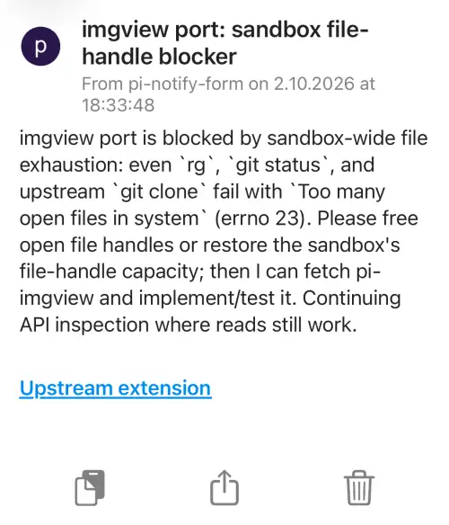

# One-way Pushover alerts for kmet

Port of `lima-default/home-manager/pi/agent/extensions/pushover-human/`.
The extension/package is named **nofity-pushover** (the requested spelling),
while the agent-facing tool remains **`notify_human`**.

`notify_human` sends one alert when work is blocked on a human decision,
approval, credentials, access, or missing external evidence. It does not wait
for or collect a reply, send progress reports, or send automatic idle alerts.
`/notify-human-test [message]` sends a manual test notification.




## Install

The `src/` directory is the extension artifact root. From this directory:

```sh
mkdir -p ~/.kmet/agent/extensions
ln -s "$PWD/src" ~/.kmet/agent/extensions/nofity-pushover
```

Alternatively, from the sibling kmet checkout, install with:

```sh
bb start install /absolute/path/to/kmet-extensions/nofity-pushover/src
```

Or add the absolute path to `src/` to `:extensions` or `:packages` in
`~/.kmet/agent/settings.edn`. Do not point those entries at the project root.
Start kmet or run `/reload`. `KMET_CODING_AGENT_DIR` relocates the agent dir
(and the `extensions/` auto-load directory).

## Credentials

Set `PUSHOVER_USER_KEY` and `PUSHOVER_APP_TOKEN` in kmet's environment,
optionally with `PUSHOVER_DEVICE`. When both credentials are nonblank, the
complete environment configuration takes precedence over the file. A partial
environment configuration falls back to the file; credentials are not mixed.

Or create `<agent-dir>/nofity-pushover.json` (normally
`~/.kmet/agent/nofity-pushover.json`):

```json
{
  "pushover": {
    "userKey": "YOUR_PUSHOVER_USER_KEY",
    "appToken": "YOUR_PUSHOVER_APP_TOKEN",
    "device": "YOUR_DEVICE_NAME"
  }
}
```

Replace the placeholders. `userKey` and `appToken` are required; omit
`device` to use your default device(s). The same keys at the JSON top level
are also accepted. Restrict the file to your account:

```sh
chmod 600 ~/.kmet/agent/nofity-pushover.json
```

Credentials are runtime-only: never commit them. This port does not read,
copy, or change Pi's `~/.pi/agent/pushover-human.json` or Home Manager setup.
To reuse that configuration, manually copy it to the kmet path with secure
permissions, or use the environment variables. Credentials reload at session
start and are retried on each explicit send while none are configured; use
`/reload` after changing already-loaded credentials.

## Tool contract

The preserved tool name is `notify_human`, with these parameters:

- `message` (required): concise blocker or question, project/task context,
  and the exact action needed; whitespace-only messages are rejected.
- `title`: defaults to `kmet needs a human decision`.
- `url`: relevant issue, PR, or dashboard link.
- `urlTitle`: short label for the link (original spelling preserved).
- `priority`: `-2` silent, `-1` quiet, `0` normal (default), or `1` high.
  Emergency priority `2` is not supported.

Title/message/URL/URL-title limits are 250/1024/512/100 characters, matching
the Pi extension. Requests are form-encoded POSTs to Pushover through
`kmet.libs.http`, honor the host's proxy configuration, have a 15-second
transport timeout, and do not follow redirects. Tool cancellation is checked
before and after the request; the abort atom is forwarded to HTTP (in-flight
cancellation is supported by the curl transport, not the native transport).
The manual command checks the context's cancellation state before sending.

Success returns a text result plus `{:status ... :device ...}` details and
updates the keyed footer status from `human notify: ready` to
`human notify: sent (200)`. Missing credentials show `human notify: no creds`
and a warning. Unload clears only this extension's footer key. The manual
command reports via UI notifications, as in the original extension.
Hostname metadata uses `HOSTNAME`, `COMPUTERNAME`, or `HOST`, then a bounded
`hostname` command, falling back to `unknown host`.

HTTP failures include the status and response body, with raw and URL-encoded
credentials redacted. Transport errors are also redacted; JSON read errors
never include credential-bearing source text. Do not include secrets or
private source text in notification content. Once configured, manually run
`/notify-human-test` to verify real delivery.

## Development

Host libraries come from the sibling `../../kmet/src/` checkout. Tests are
offline; no real Pushover notifications are sent:

```sh
bb test-changed
# or select the test namespace:
bb test nofity-pushover.core-test

# From the sibling kmet checkout:
cd ../../kmet
bb ../kmet-extensions/nofity-pushover/scripts/smoke.bb
bb lint ../kmet-extensions/nofity-pushover/src ../kmet-extensions/nofity-pushover/test ../kmet-extensions/nofity-pushover/scripts
bb format-check ../kmet-extensions/nofity-pushover/src ../kmet-extensions/nofity-pushover/test ../kmet-extensions/nofity-pushover/scripts ../kmet-extensions/nofity-pushover/bb.edn
bb pack-extension ../kmet-extensions/nofity-pushover/src target/nofity-pushover.jar
```

The manifest allows native Jolt and SCI loaders. The smoke script exercises
the real isolated SCI loader, registration, contextual tool calls, command,
abort, failures, and unload with mocked HTTP and an isolated agent dir.
Native Jolt, real delivery, and actual terminal presentation require those
environments and are not verified by the offline suite.
